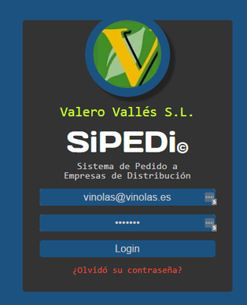
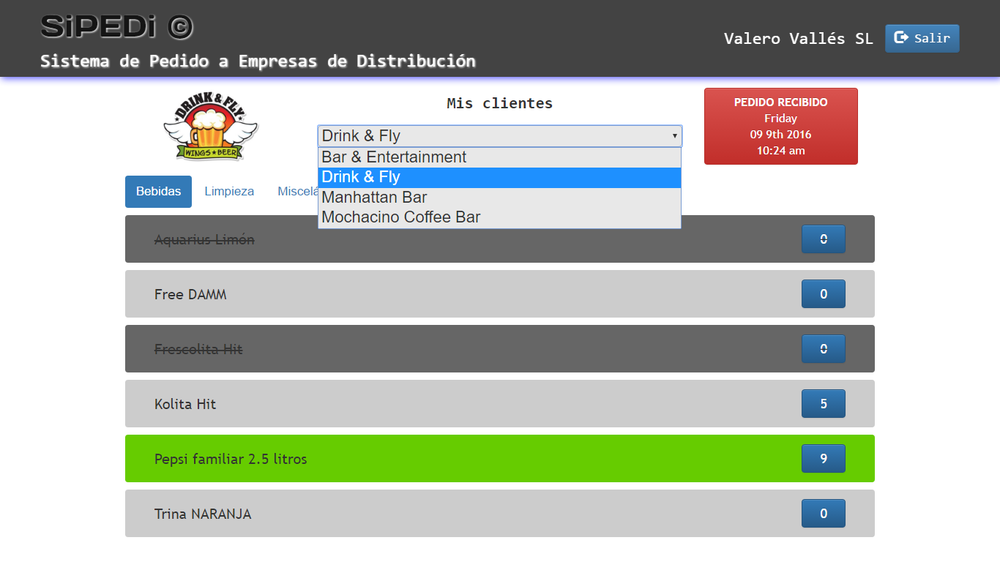

# SIPEDI

## Sistema de Pedido a Empresas de Distribución
#### Order System to Distribution Companies

http://sipedi.herokuapp.com/ 
https://dry-badlands-61893.herokuapp.com/ 
https://git.heroku.com/dry-badlands-61893.git 
https://github.com/leovidalgithub/sipedi 

Es un sistema basado en compras periódicas regulares de clientes a sus proveedores. El proveedor debe alimentar el sistema con sus productos clasificados por categorías y finalmente configurar sus clientes, asignando a cada cliente los productos que cada uno maneja.
El cliente podrá loguearse cuando quiera e ir marcando los productos de su interés. Una vez que quiera hacer el pedido lo hará simplemente clicando el botón de demanda. Una vez recibido el pedido el proveedor procederá a efectuar el despacho de la mercancía y pondrá el botón de demanda en modo despacho con fecha y hora.
Los nodos conectados se mantienen actualizados entre ellos, mostrando así la información en tiempo real.
Actualmente se está desarrollando la funcionalidad para configuración de productos y clientes para los proveedores.

***

It is a based on regular periodic customer purchases system. The provider must supply the system with their products classified by categories and finally set their customers, assigning to each customer the products that they usually buy.
The client log-in at anytime and check-off items of its interest. Once it wants to place the order just click on demand button. When order is received the supplier shall make the clearance of goods and set the demand button in delivery-mode prompt date and time.
Nodes logged are connected among them showing information in real time .

Currently, the products and customers configuration are been developing.

### to run app:
**npm run start** 
**npm run dev** (dev mod) 
**npm run build:client:watch** (dev mod) 

### Login page

### Main page

###Tecnologías y librerías principales empleadas:
####Main used technologies & libraries:

server-side
>node 4.4.7 
>express 4.14.0 
>mongodb 2.2.9 
>mongoose 4.5.9 
>jsonwebtoken 7.1.9 
>mlab 

client-side
>angularJS 1.5.8 
>bootstrap 3.3.7 
>SASS 
>jQuery 2.2.4 
>angular ui Bootstrap (directives) 
>angular-jwt (JSON WEB TOKEN) 
>angular-moment 1.0.0-beta.6 

Develonment 
>browserify 13.1.0 
>watchify 3.7.0 
>prepros 5.10.2 
>github 
>heroku 

### Usuarios para pruebas - SiPEDi
#### Test users - SiPEDi

url: http://sipedi.herokuapp.com/

_clientes/clients
>gamito@yahoo.com (Ana Gamito - Bar Entertainment) password: 1234 
>arturo@gmail.com (Arturo Rubio - Drink & Fly) password: 1234 
>carl@gmail.com (Carl - Liquor Store ) password: 1234 
>angel@hotmail.com (Ángel San Nicolás Lobby Bar) password: 1234 
>anna@yahoo.es (Anna Vila - Manhattan Bar) password: 1234 
>david@gmail.com (David Monreal - Mochacino Coffee Bar) password: 1234 
>leo@leovidal.es (Leo Rdgz. - Bar De Bellota) password: 1234 

_proveedores/suppliers_
>vinolas@vinolas.es (PROVEEDOR Viñolas Teixidor) password: 1234 
>valero@valero.es (PROVEEDOR Valero Vallès) password: 1234 

### Desarrollado por:
#### Developed by:

>Leonardo Rdgz. Vidal
>   leo@leovidal.es
